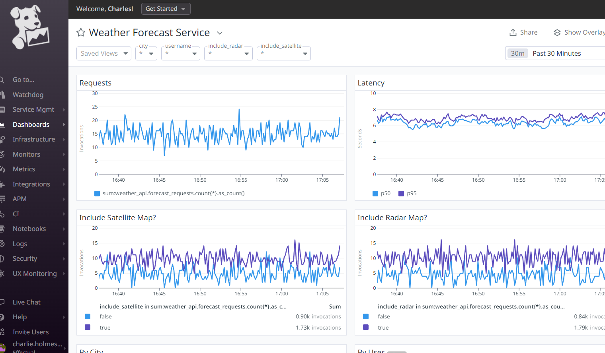
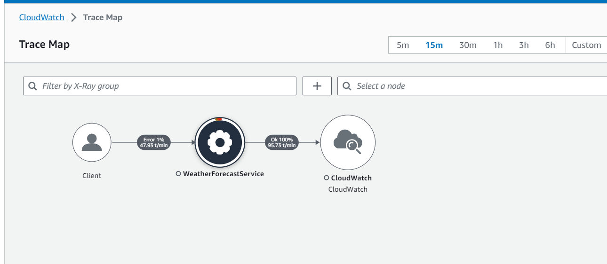
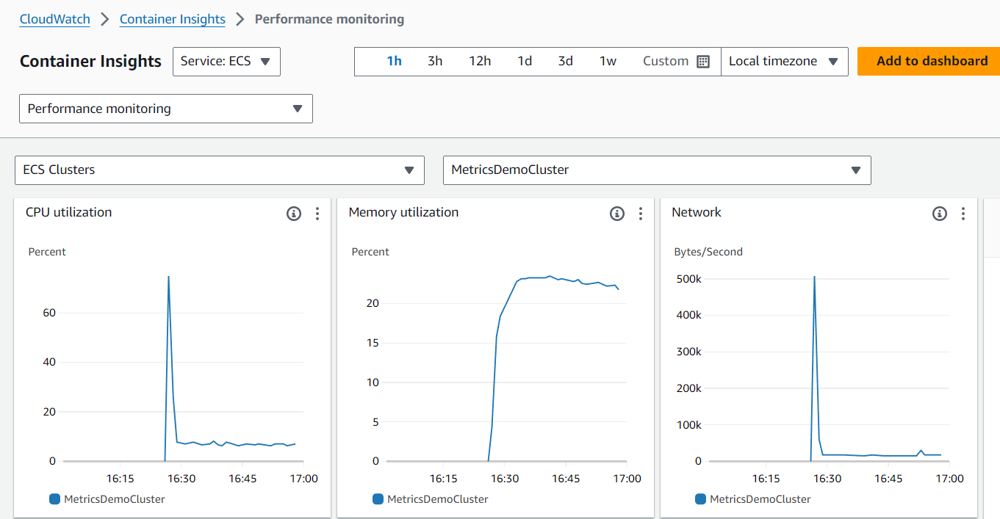

# ASP.NET Core Web API Metrics Demo

## Purpose

This project demonstrates how a modern application might produce metrics that provide insight into its current state and usage patterns.  These metrics could also be used to create alerts to provide advance notice of potential problems.

## Getting Started

### Prerequisites

1. bash, Docker, AWS CLI v2, and jq are installed on your computer
1. You have a Datadog account (either trial or paid, not free), and you know your Datadog region and API key.
1. You have an AWS account and are logged in, through the AWS CLI, as a user who has permissions to create IAM roles, ECS tasks, VPC components, etc.

### Deployment

To deploy the demo, run the following command in a shell:
```bash
DATADOG_DD_SITE="<your_dd_site>" DATADOG_SECRET_NAME="<your_secret_name>" ./deploy.sh
```
Where `DATADOG_DD_SITE` is your Datadog region (like "us5.datadoghq.com"), and `DATADOG_SECRET_NAME` is the name of an AWS Secrets Manager secret that contains your Datadog API key.  You'll need to create this before running the script.

Note:  This script has been tested in Git Bash on Windows 11 and also in Ubuntu 18.04 on WSLv2.  It *should* work under most any Linux or Unix shell, but it might require small changes.

## Components

This repo contains application code, IaC templates, and scripts that will deploy a backend API service and a task that simulates different kinds of requests that a client might make against it.

### Backend Service

The backend service is an ASP.NET Core Web API project that exposes a single endpoint and implements a single operation.

`GET /WeatherForecast?city=london&includeRadar=true&includeSatellite=false`

This endpoint expects three query string parameters: `city`, `includeRadar`, and `includeSatellite`.  It also expects (but will function without) the calling user being specified as an HTTP request header: `weather-user: charles`.

The service runs Swagger UI, even when deployed, to make testing easier.  If you want to invoke it after it's been deployed, visit the URL of the load balancer that was created in the `metrics-demo` CloudFormation stack.

The backend is deployed as an ECS Service with a Fargate launch type.  It includes a Datadog sidecar container and an X-Ray sidecar container.

### Simulated Client

The "client" is a container that runs the K6 load testing tool with [a script](SimulatedClients/simulate_load.js) that is intended to simulate semi-random user behavior.  It will call the WeatherForecast endpoint with different cities, different flags, and different usernames.

The number of concurrent requests (default: 10) can be configured by changing the `VU_COUNT` environment variable that is passed to the client container.

The request parameters and the response values do not serve any purpose other than to look like real data.  The request parameters are varied so that we can pass them as dimensions/tags alongside the metrics that the backend service is emitting.

## The Metrics
The backend API is instrumented to emit metrics about the container and application to both AWS CloudWatch and Datadog.  It also sends traces to AWS X-Ray, and it has AWS ECS Container Insights enabled.

See below some samples of the sort of output that you can expect from these platforms once the demo is running:

### Datadog

### AWS CloudWatch Metrics

### AWS X-Ray

### Container Insights

